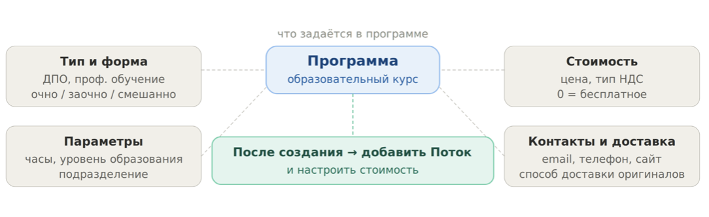

:::info 

Программа - это образовательный курс вашей организации. На её основе создаются потоки (периоды обучения) и привязываются заявки слушателей. При необходимости программу можно синхронизировать с [LMS Odin](./../../integracii/integraciya-s-lms-odin).

:::

{width=1084px height=332px}

## Добавление программы

Перейдите в раздел «Обучение» -> «Программы» -> нажмите «Создать программу».

.png>)

Укажите:

-  Название

-  [Тип программы](./tipy-programm-i-urovni-obrazovaniya) (определяет какой документ выдаётся по итогам обучения и какие данные собираются от слушателя) 

-  Форму проведения программы:

   -  Очная

   -  Очно-заочная

   -  Заочная

   -  Не указано

-  Количество академических часов, на которое рассчитана программа

-  Минимальный уровень образования слушателей, которые допускаются для обучения

-  [Подразделение](./../../Organization/sozdanie-organizacii)

-  Контактный E-mail для публикации в Личном кабинете слушателя

-  Контактный телефон для публикации в Личном кабинете слушателя

-  Сайт с информацией об обучении для публикации в Личном кабинете слушателя

-  Определие способ доставки оригиналов документов на зачисление.

{width=661px height=94px}

---

Заполните по желанию необязательные поля и сохраните Программу.

.png>)

---

После создания программы будет предложено  "Перейти к добавлению [Стоимости](./stoimost-programmy)" или заполнить стоимость позже ->  откроется страница созданной программы, где следует добавить [Поток](./../Potok/_index).

.png>)

## Редактирование программы

Откройте карточку программы (кликните по названию в списке) и нажмите на иконку карандаша.

.png>)