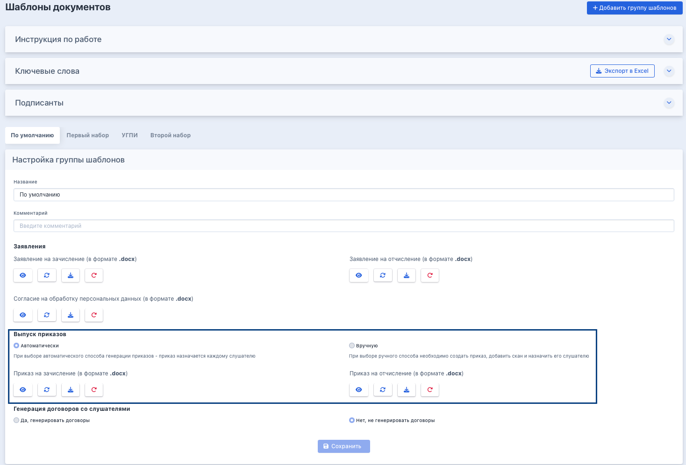

:::info 

Приказы фиксируют факт зачисления слушателя на обучение и его отчисления по итогам. 

:::

### **Типы приказов**

В системе Flow представлены **2 типа приказов**:

-  **Приказы на зачисление -** слушатель зачислен на обучение

-  **Приказы об отчислении**:

   -  Заявление слушателя - слушатель отчислен по собственному желанию

   -  Неуспеваемость - слушатель не завершил обучение успешно

   -  Выдача документа о квалификации / сертификата - слушатель успешно завершил обучение (с выдачей документа о квалификации)

### Способы выпуска

Выпускаются двумя способами (зависит от настроек [группы шаблонов](./../../Organization/Shablony/_index)):

-  [**автоматически**](./avtomaticheskii-vypusk)  (также доступен [**автоматический режим с ручными корректировками**](./avtomaticheskii-vypusk))

-  [**вручную**](./dobavlenie-prikazov-vruchnuyu).

:::tip 

Подробнее в интрактивном виджете 

:::

[html]

  

    

      
Режим выпуска

      

        <button class="pw-btn active" onclick="pwSet('mode','auto',this)">Автоматический</button>
        <button class="pw-btn" onclick="pwSet('mode','manual',this)">Ручной</button>
      

    

    

      
Как запустить

      

        <button class="pw-btn active" onclick="pwSet('launch','night',this)">Запускается сам (ночью перед днём старта потока)</button>
        <button class="pw-btn" onclick="pwSet('launch','potok',this)">Вручную со страницы потока (если требуется установить свой номер)</button>
      

    

    

      
Тип приказа

      

        <button class="pw-btn active" onclick="pwSet('ptype','enroll',this)">На зачисление</button>
        <button class="pw-btn" onclick="pwSet('ptype','dismiss',this)">На отчисление</button>
      

    

    

      
Основание

      

        <button class="pw-btn active" onclick="pwSet('reason','success',this)">Успешное завершение</button>
        <button class="pw-btn" onclick="pwSet('reason','fail',this)">Неуспеваемость</button>
        <button class="pw-btn" onclick="pwSet('reason','own',this)">По заявлению</button>
      

    

  

  

[/html]

---

### Выбор способа создания приказов

Во  Flow есть возможность **автоматического** либо **ручного** выпуска приказов. Для этого на странице шаблонов надо выбрать, какой способ создания приказов будет актуальным.

{width=1468px height=996px}

На одну программу может быть несколько шаблонов. Затем в заявке выбирается группа шаблонов, если у него установлен автоматический выпуск, то приказ сгенерируется автоматически; если же на группу шаблонов выбрана ручная генерация, то приказ надо будет добавить в систему.

При выборе **автоматического** способа генерации приказов назначаются приказы со следующими типами:

-  приказ на зачисление с одним номером на поток

-  приказ на отчисление в связи с успешным окончанием с одним номером

-  приказ на отчисление в связи с неуспешным окончанием с одним номером

-  приказ на отчисление по заявлению.

При выборе **ручного** способа необходимо создать приказ на поток, где обучается слушатель, затем назначить его слушателю. (На поток может быть несколько приказов, если это необходимо в образовательной организации) Подробнее о создании [**автоматического**](./avtomaticheskii-vypusk) либо [**ручного**](./dobavlenie-prikazov-vruchnuyu) способа выпуска приказов.

### Даты в приказах на зачисление

Возможны три варианта генерации приказов на зачисление в зависимости от даты начала обучения.

[tabs]

[tab:В дату начала обучения]

Датой приказа на зачисление в этом случае будет дата старта потока. У "добегающих" на поток граждан датой приказа будет также дата старта потока.

[/tab]

[tab:До даты начала обучения]

Можно дать слушателям ранний доступ к обучению по кнопке "Записать на обучение в Odin". Приказы сформируются в день старта потока с датой старта потока.

[/tab]

[tab:После даты начала обучения]

У "добегающих" на поток слушателей, которым по кнопке "Записать на обучение в Odin" дали ранний доступ к обучению уже после старта потока, но ДО выпуска приказа на зачисление, приказ будет выпущен после подтверждения документов на зачисление с датой старта потока в приказе.

[/tab]

[/tabs]

### Перевыпуск приказов

На странице приказов при нажатии на "Перевыпустить приказ" появляется общее модальное окно для всех типов приказов, но компоненты в окне разные: отдельно для зачисления, отдельно для отчисления. Если необходимо перепустить приказ об отчислении, то в модальном окне можно перегенерировать только тот приказ, который уже был выпущен, то есть нельзя изменить тип приказа об отчислении с "По собственному желанию" на "Об отчислении за неуспеваемость". Это разные типы приказов об отчислении.

## Удаление приказов

:::note 

**Удалить приказ нельзя. Можно заменить скан приказа или перегенерировать приказ (изменить состав слушателей, номер, дату).** 

:::