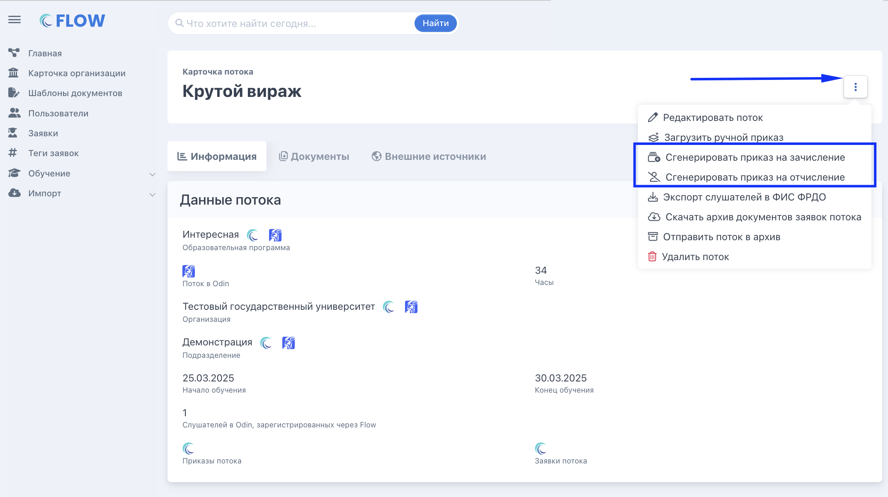
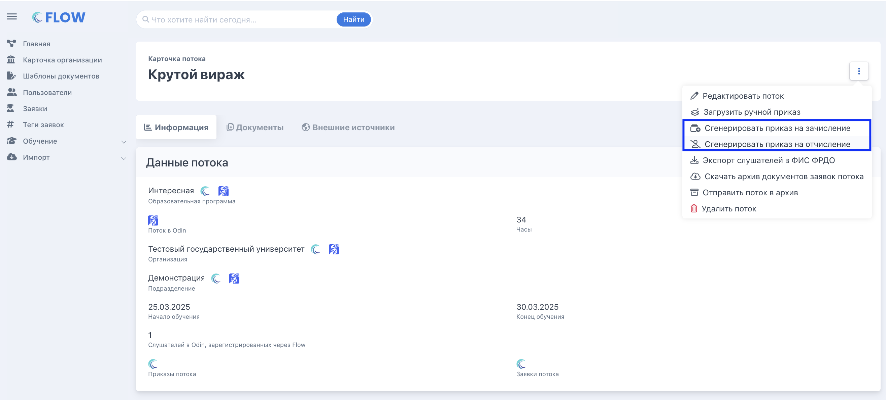

:::info 

При автоматическом режиме система сама генерирует приказы на зачисление и отчисление в нужный момент и прикрепляет их к заявкам. Менеджеру не требуется создавать приказы вручную.

:::

### **Нумерация приказов**

**Номера приказов генерируются по шаблону: \[префикс\]-\[ID потока\]-\[тип документа\].**

**Пример: ИСО-2673-ПЗ, где ИСО -- префикс организации, 2673 -- ID потока, ПЗ -- «Приказ о Зачислении».**

**Для слушателей с поздним зачислением слушателей к номеру добавляется порядковый номер начиная с 2: ИСО-2673-ПЗ-2, ИСО-2673-ПЗ-3 и т.д.**

:::tip 

Префикс настраивается в разделе «Общая информация организации » -> «[Префикс организации для генерируемых документов](./../Programma/_index)».

:::

## **Приказ на зачисление**

### **Когда генерируется**

Автоматический приказ на зачисление на весь поток генерируется в день старта потока в 00:30 по московскому времени (21:30 предыдущего дня по UTC).

Датой регистрации приказа всегда является дата старта потока. На каждую группу шаблонов генерируются отдельные приказы.

### **Кто попадает в приказ**

В приказ попадают все слушатели потока, у кого на момент генерации одобрены документы на зачисление (ДЗС): заявление, согласие на обработку персональных данных и договор (если договор требуется для данной заявки). В  приказе перечислены все включённые слушатели.

#### **Слушатели с поздним зачислением слушатели**

После старта потока система ежедневно запускает генерацию новых приказов для слушателей, которые получили одобренные ДЗС после выпуска основного приказа. Каждый новый приказ получает отдельный номер (ИСО-2673-ПЗ-2, ИСО-2673-ПЗ-3...).

Если «слушателю с поздним зачислением»  был дан ранний доступ к обучению (по кнопке «Записать на обучение в Odin» )до выпуска приказа - его приказ также будет с датой старта потока.

## **Приказы на отчисление**

:::info 

Каждый тип отчисления оформляется отдельным приказом. Смешивать разные основания в один приказ нельзя.

:::

| **Тип приказа**                                  | **Когда генерируется**                                                                                           | **Кто попадает**                                                                                        |
|--------------------------------------------------|------------------------------------------------------------------------------------------------------------------|---------------------------------------------------------------------------------------------------------|
| По заявлению слушателя                           | Раз в сутки: в день одобрения заявления на отчисление (или на следующий, если задача уже отработала в этот день) | Слушатели, у кого есть одобренное и подписанное заявление на отчисление и ещё нет приказа на отчисление |
| За неуспеваемость                                | Ночью после дня завершения обучения в потоке                                                                     | Слушатели, со статусом «Не завершил обучение», и  у кого ещё нет приказа на отчисление                  |
| С выдачей документа о квалификации (сертификата) | Ночью после дня завершения обучения в потоке                                                                     | Слушатели со статусом «Завершил успешно» у кого ещё нет приказа на отчисление                           |

:::info 

После первого приказа на отчисление система ежедневно генерирует новые приказы для слушателей, завершивших обучение позже. Каждый новый приказ получает отдельный номер.

:::

## **Генерация со страницы потока**

:::info 

Автоматический режим удобен - система сама знает когда и кого включить в приказ. Но иногда нужно больше контроля: задать свой номер приказа, выбрать конкретную дату, сформировать приказ только на часть слушателей потока или не ждать ночного запуска.

Для этого в карточке потока доступна ручная генерация -- она работает по тем же правилам что и автоматическая, но вы сами выбираете момент запуска и параметры.

Это не отдельный режим - это часть автоматического. Галочка «Автоматически» в шаблоне должна быть включена, чтобы удалось сгенерировать приказ, по выбранной группе шаблонов.

:::

### **Как запустить**

1. Откройте карточку потока.

2. Нажмите на «…» (троеточие) -> «Сгенерировать приказ».

3. В модальном окне выберите тип приказа (зачисление или отчисление), шаблон (если групп несколько), дату и номер.

4. Проверьте список заявок -- система автоматически отфильтрует подходящих слушателей.

5. Нажмите «Сгенерировать».

:::info 

Если у организации одна группа шаблонов - поле выбора шаблона скрыто, вместо него отображается ссылка на шаблон.

:::

{width=2142px height=1200px}

#### **Дата в приказе на отчисление**

Дата приказа на отчисление должна находиться в рамках периода обучения: не раньше даты начала потока и не позже даты окончания. В календаре даты за пределами этого периода недоступны для выбора.

#### **Фильтрация заявок в модальном окне (приказ на отчисление)**

**В список заявок попадают только те слушатели, у кого есть приказ на зачисление. Дополнительная фильтрация по типу приказа на отчисление:**

-  **По заявлению** -- только заявки с подписанным и одобренным заявлением на отчисление.

-  **Неуспеваемость** -- только заявки со статусом «Не завершил обучение».

-  **Успешное завершение** -- только заявки со статусом «Завершил успешно».

В списке отображаются ФИО и дата рождения, сортировка по алфавиту.

### Действия с автоматически сгенерированным приказом

На странице «Обучение» -> «Приказы» для каждого автоматического приказа доступны три действия:

[html]

  <table class="pa-table">
    <thead>
      <tr>
        <th style="width:56px">Кнопка</th>
        <th style="width:160px">Действие</th>
        <th>Что делает</th>
      </tr>
    </thead>
    <tbody>
      <tr>
        <td>
          

            <svg width="16" height="16" viewBox="0 0 24 24" fill="none" stroke="#185FA5" stroke-width="2" stroke-linecap="round" stroke-linejoin="round"><path d="M1 12s4-8 11-8 11 8 11 8-4 8-11 8-11-8-11-8z"/><circle cx="12" cy="12" r="3"/></svg>
          

        </td>
        <td>
Просмотр
</td>
        <td>
          
Открывает сгенерированный документ приказа и бланк приказа без печати

        </td>
      </tr>
      <tr>
        <td>
          

            <svg width="16" height="16" viewBox="0 0 24 24" fill="none" stroke="#085041" stroke-width="2" stroke-linecap="round" stroke-linejoin="round"><path d="M14.7 6.3a1 1 0 0 0 0 1.4l1.6 1.6a1 1 0 0 0 1.4 0l3.77-3.77a6 6 0 0 1-7.94 7.94l-6.91 6.91a2.12 2.12 0 0 1-3-3l6.91-6.91a6 6 0 0 1 7.94-7.94l-3.76 3.76z"/></svg>
          

        </td>
        <td>
Изменить данные приказа
</td>
        <td>
          
Открывает модальное окно для корректировки приказа:

          <ul class="pa-list">
            <li>тип приказа на отчисление</li>
            <li>номер приказа</li>
            <li>дату приказа</li>
            <li>список заявок — добавить или убрать слушателей</li>
          </ul>
          
После изменений нажмите «Сгенерировать» — приказ будет перевыпущен с новыми данными.

          
Нельзя изменить приказ на зачисление на приказ на отчисление. Нельзя изменить основание отчисления — «По заявлению» и «Неуспеваемость» это разные типы.

        </td>
      </tr>
      <tr>
        <td>
          

            <svg width="16" height="16" viewBox="0 0 24 24" fill="none" stroke="#854F0B" stroke-width="2" stroke-linecap="round" stroke-linejoin="round"><polyline points="1 4 1 10 7 10"/><path d="M3.51 15a9 9 0 1 0 .49-3.47"/></svg>
          

        </td>
        <td>
Загрузить скан
</td>
        <td>
          
Позволяет заменить сгенерированный файл на свой вариант — например, с ручной подписью и печатью. Загруженный скан заменяет автоматически сгенерированный документ.

          
Форматы: BMP, PNG, JPG, JPEG, PJP, PJPEG, JFIF, PDF · Максимум 30 МБ

        </td>
      </tr>
    </tbody>
  </table>

[/html]

### **Управление составом слушателей в приказе**

#### **Добавить слушателя в приказ**

**Если после выпуска приказа появились новые слушатели, подходящие под его условия, их можно добавить через «Изменить данные в приказе».**

1. Перейдите в «Обучение» -> «Приказы».

2. Найдите нужный приказ и нажмите **«Изменить данные в приказе»**.

3. В модальном окне добавьте новых слушателей из выпадающего списка -- система покажет только подходящих.

4. Нажмите «Сгенерировать» -- приказ обновится с расширенным списком.

#### **Убрать слушателя из приказа**

**Если слушатель попал в приказ на отчисление ошибочно - исключите слушателя из приказа, для остальных слушателей того же приказа система автоматически перегенерирует приказ уже без него.**

1. Перейдите в «Обучение» -> «Приказы».

2. Найдите нужный приказ и нажмите **«Изменить данные в приказе»**.

3. В модальном окне исключите  слушателей из выпадающего списка -- система покажет только подходящих.

4. Нажмите «Сгенерировать» -- приказ обновится с новым списком.

:::info 

Исключение из  приказа возвращает заявки слушателей в активный статус на предыдущий этап. 

:::

#### **Загрузить  приказ из карточки потока**

**Прямо из карточки потока можно загрузить ручной приказ - например, если приказ подписан вручную и его скан требуется прикрепить к потоку.**

1. Откройте список потоков.

2. Нажмите {width=70px height=56px} .

3. Прикрепите файл скана (форматы: PDF, PNG, JPG, JPEG, BMP, JFIF) до 30 мб.

4. Нажмите «Сохранить».

#### **Ключевые слова для шаблонов приказов**

Для приказов доступны специальные ключевые слова, которые можно использовать только в шаблонах приказов:

| **Ключевое слово**        | **Что подставляет**            | **Примечание**                                                                             |
|---------------------------|--------------------------------|--------------------------------------------------------------------------------------------|
| §CitizenRequestFullNames§ | ФИО всех слушателей приказа    | Используется в таблице -- перечисляет всех включённых в приказ                             |
| §CitizenEducationLevel§   | Уровень образования слушателя  | Работает только в таблице, рядом с §CitizenRequestFullNames§. Вне таблицы остаётся пустым. |
| §OrderDate§               | Дата генерации приказа текстом | Формат: «01» января 2025 г.                                                                |
| §CohortStartDate§         | Дата старта потока             |                                                                                            |
| §CohortEndDate§           | Дата окончания потока          |                                                                                            |

## Автоматический режим с ручными корректировками

:::info 

При автоматическом режиме система сама генерирует приказы каждую ночь. Если стандартного поведения недостаточно - например, нужен другой номер, определённая дата или приказ на конкретных слушателей - можно запустить генерацию вручную со страницы потока.

:::

Это тот же автоматический режим и приказ будет сгенерирован по установленному шаблону (где вместо ключевых слов будут подставлены данные пользователей) и добавлен в выбранные заявки, просто вы контролируете момент запуска и параметры в приказе:

-  выбираете нужный шаблон (если их несколько)

-  задаёте номер и дату приказа

-  выбираете всех или только конкретных слушателей потока

-  устанавливаете основание приказа на отчисление ( только для приказов на отчисление)

{width=2632px height=1192px}

:::tip 

Уже выпущенный приказ можно скорректировать на странице со списком  приказов: изменить номер, дату или состав слушателей.

:::