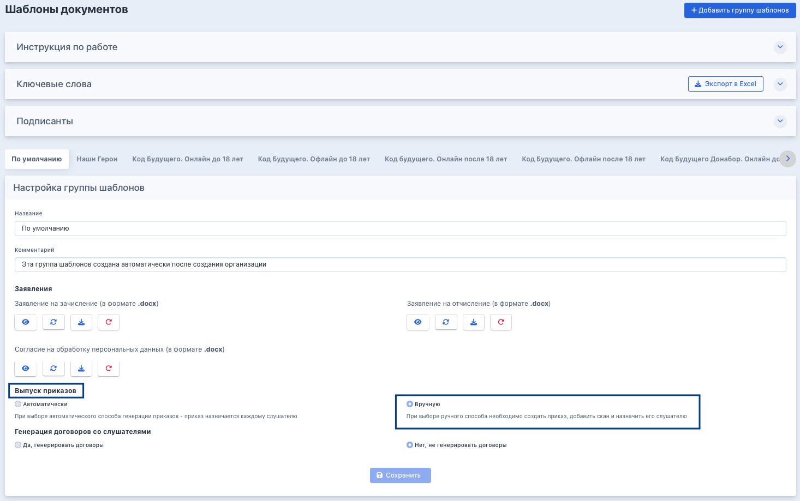
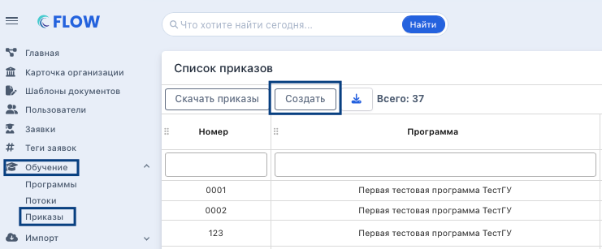
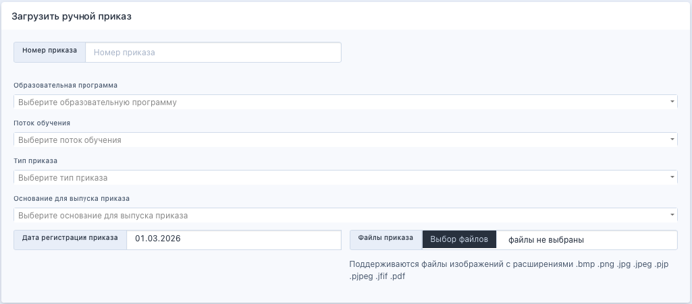
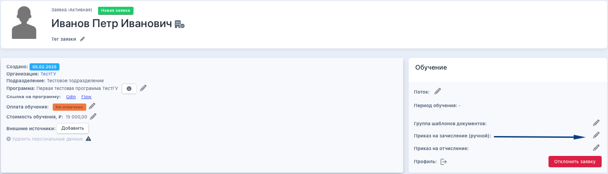
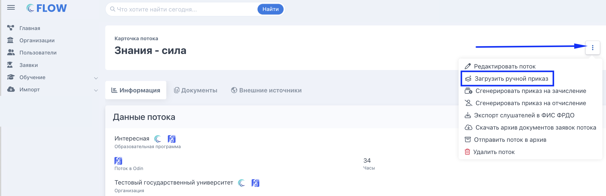
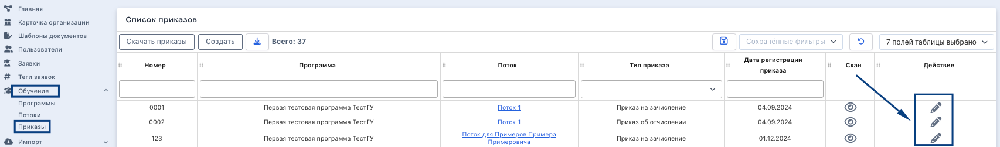

:::info 

**Ручной способ** выпуска приказов используется когда организация самостоятельно управляет составом приказов, датами и номерами. Для каждого потока создаётся отдельный приказ, который затем назначается слушателям.

:::

*Сначала включите ручной выпуск приказов в настройках группы шаблонов: «Шаблоны документов» -> «Настройка групп шаблонов» -> выберите ручной способ.*

{width=1466px height=919px}

## Шаг 1. Создание приказа

Добавьте приказ через пункт меню "Обучение» -> "Приказы» -> нажмите "Создать".

{width=741px height=307px}

:::tip 

На один поток может быть несколько приказов с разными списками слушателей -- например, если часть слушателей зачисляется позже.

:::

Заполните следующие поля:

-  Номер

-  Образовательная программа

-  Поток

-  Тип

-  Основание для выпуска

-  Дата регистрации

-  Загрузите скан-копию приказа. Если в момент создания приказа скан-копии ещё нет, то можно вернуться к редактированию приказа и загрузить скан позже. Для каждого приказа загружается только одна скан-копия. На один поток может быть несколько приказов с разными списками слушателей.

{width=1025px height=451px}

## Шаг 2. Назначение приказа слушателю

1. **После создания приказа его необходимо привязать к каждому слушателю отдельно.**

   1. Перейдите в «Заявки» и отсортируйте по нужному этапу.

   2. Откройте карточку заявки.

   3. В блоке «Обучение» нажмите «Редактировать».

   4. Выберите нужный приказ из списка доступных и нажмите «Сохранить».

:::info 

Приказ доступен для назначения только если в заявке выбрана группа шаблонов с ручным способом выпуска приказов.

:::

{width=1339px height=385px}

В открывшемся модальном окне появятся доступные приказы. Надо выбрать верный и нажать "Сохранить".

.png>)

## Шаг 2. Назначение приказа на поток

Для того, чтобы не заходить в каждую заявку, можно массово назначить приказ для всего потока.  

{width=2372px height=770px}

## Этапы заявок для назначения приказов

**Этапы заявок для назначения приказов**

| **Этап заявки**                                                         | **Тип приказа**                               |
|-------------------------------------------------------------------------|-----------------------------------------------|
| Требуется выпустить приказ на зачисление                                | Приказ на зачисление                          |
| Требуется загрузить приказ на отчисление на основании заявления         | Приказ на отчисление - по заявлению слушателя |
| Требуется загрузить приказ на отчисление в связи с успешным завершением | Приказ на отчисление - успешное завершение    |
| Требуется загрузить приказ на отчисление за неуспеваемость              | Приказ на отчисление - неуспеваемость         |

### Редактирование приказов

Для редактирования приказа перейдите в «Обучение» -> «Приказы» и нажмите «Редактировать» напротив нужного приказа. Можно изменить номер, дату выпуска и загрузить или заменить скан-копию.

{width=1706px height=251px}