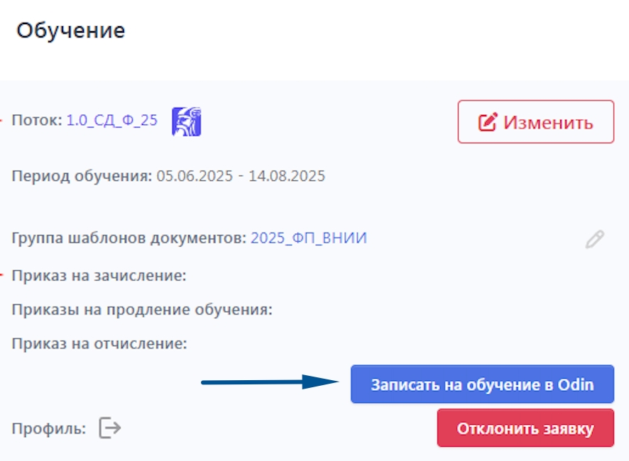
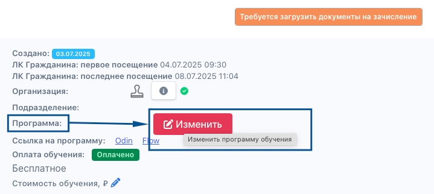
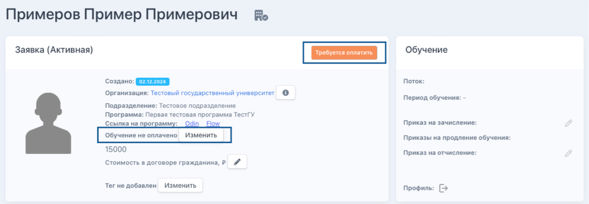
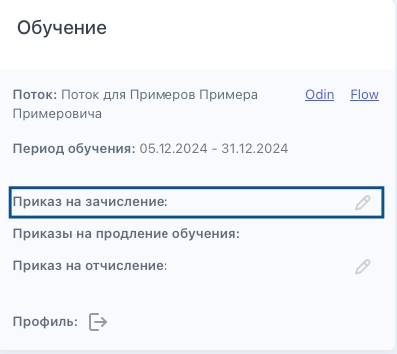

Есть возможность отправить заявку на обучение при наличии минимума заполненных данных, чтобы слушатель параллельно с обучением предоставлял все необходимые документы.

Для этого в карточке заявки добавлена кнопка "Записать на обучение в Odin".

{width=886px height=650px}

Кнопка будет доступна в случае если:

-  есть интеграция с программой Одина

-  у заявки выбран поток

-  поток есть в Odin

-  у заявки нет профиля в Odin

-  нет приказа на зачисление у этой заявки

По нажатию на кнопку выводится модальное окно с предупреждением: "Обратите внимание: после подтверждения записи слушатель: 

\- получит письмо-приглашение для входа в Odin; 

\- будет пользоваться материалами программы и проходить обучение.

Вы сможете параллельно с учебным процессом провести заполнение анкеты, загрузку документов, приказа на зачисление и оплату".

До этапов оплаты обучения или до одобрения ДЗС (смотря какое действие по сценарию должно быть первым) доступен **перевод заявки из программы в программу** со сменой потока. Сделать это можно по кнопке "Изменить" рядом с программой.

{width=719px height=322px}

#### **Этап "Новая заявка"**

Когда заявка только попадает в систему, то ее статус будет указан как "Новая заявка".

{width=1260px height=437px}

На этом этапе будущему слушателю необходимо войти в свой ЛК, включить уведомления, уточнить свой уровень образования.

#### **Этап "Требуется оплатить"**

После предыдущих совершенных действий статус изменится на "Требуется оплатить". Необходимо связаться со слушателем и произвести с ним расчет удобным для образовательной организации способом. После оплаты проставить отметку в системе по кнопке "Изменить" около строки "Обучение не оплачено".

{width=1692px height=586px}

В открывшемся окошке надо проставить галку "Обучение оплачено" и нажать "Сохранить".

{width=670px height=356px}

Также возможность оплаты добавлена в ЛК заявки. На этом шаге добавлена кнопка "Оплатить", которая переводит пользователя на страницу оплаты. Кнопка “Перейти к оплате” не активна, пока пользователь не отметит чек-бокс. Стоимость обучения подтягивается из программы, на которую подана заявка.

Если у заявки стоимость обучения равна 0, то этап оплаты пропускается, а в заявке автоматически проставляется статус оплаты "Оплачено". В заявке показывается плашка с текстом "Бесплатное".

#### **Этап "Требуется выбрать период обучения"**

После оплаты строка "Обучение не оплачено" поменяется на "Обучение оплачено" и статус отобразится "Требуется выбрать период обучения".

#### **Этап "Требуется проверить анкету"**

Далее участник выбирает период обучения, заполняет персональные данные, загружает копии страниц паспорта, а также фотографию профиля. Далее по заявке уточняется образование. Заявка на каждом из этих этапов заполнения информации будет находиться в статусе "Требуется проверить анкету". Необходимо проверить и подтвердить копии паспорта и документа об образовании, чтобы будущий слушатель мог продвинуться дальше.

{width=1255px height=1079px}

Если же документ подтвержден ошибочно, его можно отклонить.

#### **Этап "Требуется загрузить документы на зачисление"**

После подтверждения документов заявка перейдет в статус "Требуется загрузить документы на зачисление".

{width=1254px height=1138px}

#### **Этап "Требуется проверить документы на зачисление"**

После загрузки в заявку заявления на зачисление и согласия на обработку данных (шаблоны для заполнения доступны в ЛК) она перейдет в статус "Требуется проверить документы на зачисление". Также по кнопке "Подтвердить" после проверки можно принять данные документы.

{width=1247px height=873px}

#### **Этап "Требуется выпустить приказ на зачисление"**

Далее заявка переходит в статус "Требуется выпустить приказ на зачисление". Сначала надо создать [приказ](./../../obuchenie/README-3/_index) в системе, а затем по кнопке "Карандашик" возле строки "Приказ на зачисление" в блоке "Обучение" добавить приказ в заявку.

{width=397px height=354px}

#### **Этап "Ожидаем завершения обучения"**

После добавления приказа заявка получает статус "Ожидаем завершения обучения", а образовательная организация получает оригиналы документов от будущего слушателя.

#### **Этап "Требуется выпустить документ о квалификации"**

Когда слушатель успешно завершил обучение, образовательная организация должна выпустить документ о квалификации, предусмотренный процессом. После выпуска в систему необходимо внести данные такого документа.

#### **Этап "Требуется загрузить скан документа о квалификации"**

Далее после внесения данных о документе следует на странице заявки загрузить скан.

#### **Этап "Обучен. Услуга оказана"**

После загрузки скана документа и выдачи его слушателю (если предусмотрен оригинал) обучение считается завершенным, а услуга оказанной.