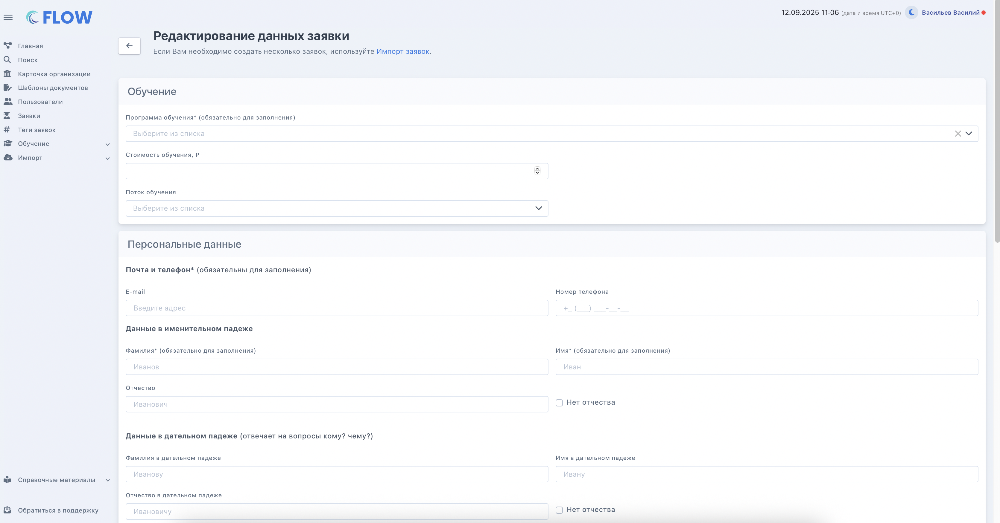
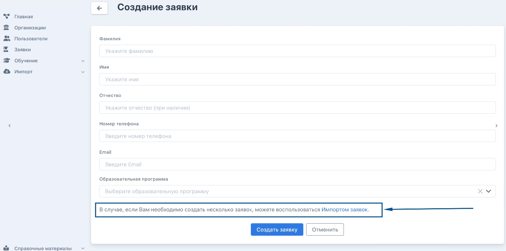
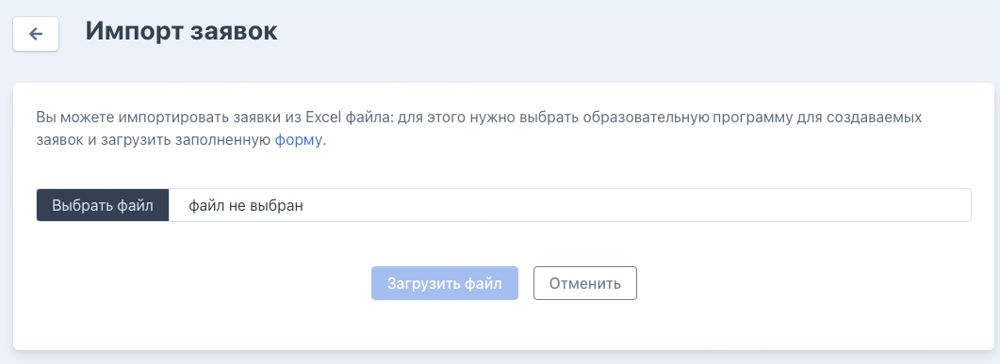
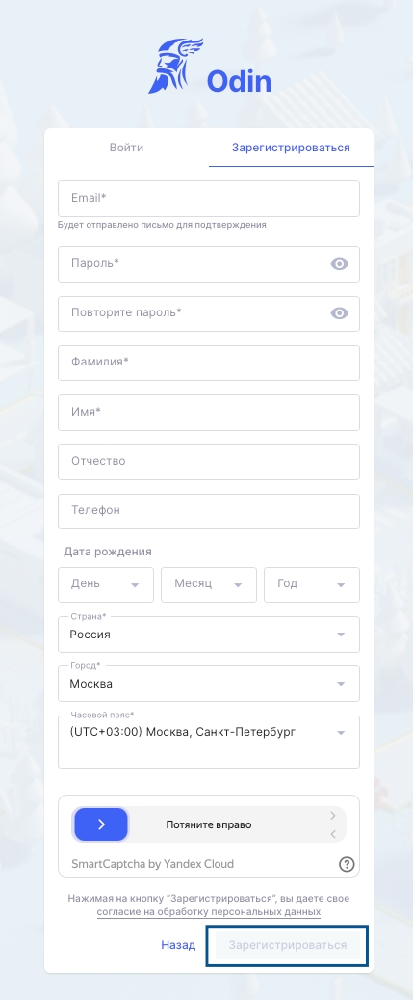

Для работы в системе с данными будущих слушателей создаются заявки

Есть три  способа попадания заявки в систему Flow:

1. Добавление заявки с лендинга

2. Добавление заявки вручную

3. Массовый импорт

Если у образовательной организации есть лендинг, то пользоваться можно всеми тремя способами, если же лендинга нет, то доступны только добавление вручную и импорт. Ниже подробно описаны все варианты добавления заявок.

.png>)

[tabs]

[tab:С лендинга]

Одним из способов является возможность привязать лендинг для подачи заявок к системе Flow. После заполнения информации об организации возможно будет получить токен, который далее используется при настройке формы сбора заявок на вашем сайте. Вам необходимо обратиться к администратору вашего сайта и попросить его настроить форму по приёму заявок по этой [инструкции](./../../../Organization/Token/forma-sbora-zayavok-na-saite-organizacii).

В данном случае будущий слушатель самостоятельно заходит в свой личный кабинет и заполняет всю информацию, а также загружает документы. Представителю организации необходимо вовремя проверять такие заявки, утверждать/отклонять загруженные документы, а также быть на связи в случае возникновения вопросов.

Также в карточке программы можно скачать инструкцию для сбора заявок.

{width=813px height=159px}

[/tab]

[tab:Вручную]

Можно вручную занести информацию по заявке в систему. Для этого во Flow надо зайти в меню "Заявки" - "Создать заявку".

{width=1301px height=257px}

На странице создания заявки заполнить все необходимые данные.

{width=3342px height=1750px}

Внизу страницы снова нажать «Создать заявку».

[/tab]

[tab:Импорт]

Третьим способом массового создания заявок является Импорт. В случае, если необходимо создать несколько заявок, можно воспользоваться [Импортом заявок](https://web.flow-crm.study/Requests/ImportRequests). Чтобы попасть на страницу импорта, необходимо зайти в Заявки - Создать заявку - Импорт заявок.

{width=1545px height=769px}

Можно импортировать заявки из Excel файла: для этого надо выбрать образовательную программу для создаваемых заявок и загрузить в специальное окно заполненную [форму](https://web.flow-crm.study/files/Requests_form.xlsx).

{width=1061px height=387px}

[/tab]

[tab:Вручную в Odin]

Можно создать профиль студента изначально в Odin. Для этого надо заполнить все данные на странице регистрации и нажать "Зарегистрироваться".

{width=429px height=1037px}

Если такого студента затем добавить в группу, то во Flow он самостоятельно автоматически никак не отобразится.

Для переноса студента во Flow необходимо создать во Flow пользователя с такой же почтой, в этом случае профили автоматически свяжутся между собой, при этом программа и поток также должны совпадать у студента в обеих системах. Создать профиль можно по кнопке "+" на странице "Пользователи".

{width=897px height=683px}

[/tab]

[tab:Сбор заявок с дополнительными данными ]

Для сбора заявок с какими-либо данными, которые в дальнейшем будут отображаться в карточке заявки, можно использовать такой функционал Flow, как:

\- [\*\*внешние источники \*\*](./../../../instrukcii/kak-rabotat-s-vneshnimi-istochniki)(если хотите, чтобы собранные данные были доступны в заявке только для сотрудников вашей организации)

**\-** либо же [\*\*дополнительные поля \*\*](./../../../Organization/dopolnitelnye-dokumenty-i-polya-vvoda-dannykh/_index)(чтобы обучающиеся сами заполняли какую-либо информацию в своих ЛК и она в дальнейшем показывалась в карточках заявок).

Для этого предварительно, ДО начала сбора заявок, необходимо создать внешние источники или дополнительные поля на соответствующих вкладках в карточке организации.

Для добавления внешних источников необходимо зайти на вкладку «Внешние источники» со страницы карточки организации.

{width=1666px height=285px}

На соответствующей вкладке надо добавить необходимое количество внешних источников.

{width=1656px height=334px}

По каждому источнику заполнить: само название источника; короткое название на английском языке (не использовать ничего, кроме английских букв, его мы далее будем вставлять в код формы); выбрать значение «*Заявка гражданина*» в поле «*В каком разделе Flow будет использоваться?*»; проставить при необходимости галочку «*Должно быть уникальным значением*», чтобы каждый раз, когда кто-то заполняет форму, в это поле можно было ввести только уникальную информацию, например, какой-нибудь промокод; не проставляем галочку «Скрыто в интерфейсе», если надо, чтобы дополнительная информация выводилась в заявке.

{width=1656px height=567px}

Нажимаем «Сохранить». Заполненный внешний источник выглядит следующим образом:

{width=1656px height=479px}

Для создания **дополнительного поля** идём на вкладку «Дополнительные данные» на странице карточки организации  и разворачиваем блок «Дополнительные поля».

{width=1657px height=541px}

Нажимаем «Добавить новое поле». Заполняем само название поля (так оно будет называться в ЛК для слушателя), выбираем формат ввода данных, вводим ключевое слово, только английскими буквами (его мы вставим в код формы), и при необходимости заполняем информацию для слушателя (т.е. пояснения к заполнению поля, если это нужно). Если вам нужно, чтобы слушатель мог пропустить заполнение этого дополнительного поля, то отмечать галочку «Обязательно для заполнения» не нужно. Сохраняем.

Заполненное дополнительное поле выглядит так:

{width=1657px height=635px}

\___________________________________________________________________________________________\_

После добавления внешних источников и/или дополнительных полей, следует внести некоторые изменения в код формы из [Шага 3 основной инструкции](./../../../Organization/Token/forma-sbora-zayavok-na-saite-organizacii). Рассмотрим на примере только что созданного источника «Промокод»:

{width=1624px height=226px}

Нам нужно, чтобы в коде были указаны название внешнего источника/дополнительного поля и его название на английском языке. В коде, приведённом ниже, показано, как правильно это сделать, строки для внесения данных выделены жирной заливкой.

То есть, вместо **Промокод** можно внести любое название вн.источника/доп.поля, а вместо **promo**, внутрь кавычек внести соответствующее ему английское слово, главное, чтобы они были созданы в организации заранее.

\<form id="requestForm">

\<input type="hidden" name="EducationalProgramId" value="1">

\<input type="hidden" name="Token" value="fefaa9b1-21e4-49ef-929b-5daddd1033f6">

\<label for="firstName">Имя:\</label>

\<input type="text" name="FirstName" required maxlength="30">\ \ 

\<label for="lastName">Фамилия:\</label>

\<input type="text" name="LastName" maxlength="30">\ \ 

\<label for="middleName">Отчество:\</label>

\<input type="text" name="MiddleName" maxlength="30">\ \ 

\<label for="email">Email:\</label>

\<input type="email" name="Email" required maxlength="30">\ \ 

\<label for="phone">Телефон:\</label>

\<input type="tel" name="Phone" required maxlength="15">\ \ 

**\<label for="promo">Промокод:\</label>**

**\<input type="text" name="Promo" required>\ \ **

\<button type="submit">Отправить\</button>

\</form>

\
\

Далее работу с формой можно продолжать с [Шага 4 основной инструкции](./../../../Organization/Token/forma-sbora-zayavok-na-saite-organizacii).

[/tab]

[/tabs]

## Видеоинструкция

[video:https://rutube.ru/video/f5d3cd9e6401a0f8bafe6b521a4251d2/]