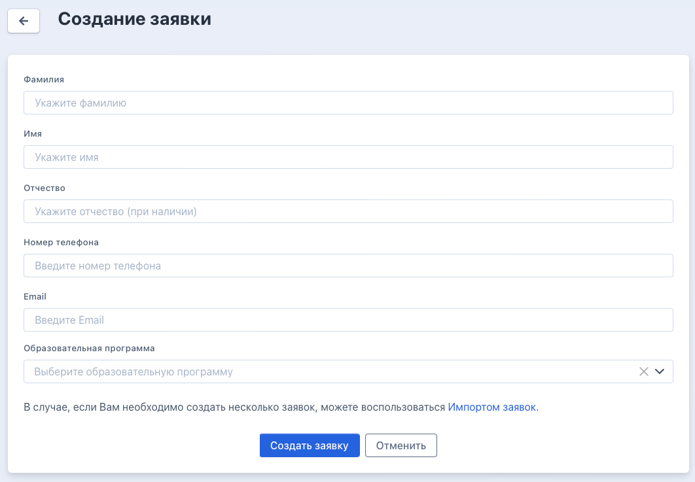
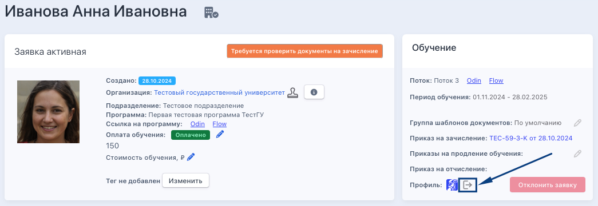

Для работы в системе с данными будущих слушателей создаются заявки

Есть три  способа попадания заявки в систему Flow:

1. Добавление заявки с лендинга

2. Добавление заявки вручную

3. Массовый импорт

Если у образовательной организации есть лендинг, то пользоваться можно всеми тремя способами, если же лендинга нет, то доступны только добавление вручную и импорт. Ниже подробно описаны все варианты добавления заявок.

.png>)

[tabs]

[tab:С лендинга]

Одним из способов является возможность привязать лендинг для подачи заявок к системе Flow. После заполнения информации об организации возможно будет получить токен, который далее используется при настройке формы сбора заявок на вашем сайте. Вам необходимо обратиться к администратору вашего сайта и попросить его настроить форму по приёму заявок по этой [инструкции](./../../../README-2/README-2/forma-sbora-zayavok-na-saite-organizacii).

В данном случае будущий слушатель самостоятельно заходит в свой личный кабинет и заполняет всю информацию, а также загружает документы. Представителю организации необходимо вовремя проверять такие заявки, утверждать/отклонять загруженные документы, а также быть на связи в случае возникновения вопросов.

Также в карточке программы можно скачать инструкцию для сбора заявок.

{width=813px height=159px}

[/tab]

[tab:Вручную]

Можно вручную занести информацию по заявке в систему. Для этого во Flow надо зайти в меню "Заявки" - "Создать заявку".

{width=1301px height=257px}

На странице создания заявки заполнить все необходимые данные и в конце снова нажать "Создать заявку".

{width=1062px height=737px}

В этом случае создается заявка с неполными данными. Для заполнения всех необходимых данных по будущему слушателю надо представителю образовательной организации войти под ним и добавить информацию и документы. Сделать это можно по кнопке со страницы заявки.

{width=1045px height=361px}

На открывшейся странице следует заполнить все необходимые поля поэтапно, загрузить документы.

{width=1258px height=1263px}

Документы, добавленные представителем организации, будут одобрены автоматически.

[/tab]

[tab:Импорт]

Третьим способом массового создания заявок является Импорт. В случае, если необходимо создать несколько заявок, можно воспользоваться [Импортом заявок](https://web.flow-crm.study/Requests/ImportRequests). Чтобы попасть на страницу импорта, необходимо зайти в Заявки - Создать заявку - Импорт заявок.

{width=1545px height=769px}

Можно импортировать заявки из Excel файла: для этого надо выбрать образовательную программу для создаваемых заявок и загрузить в специальное окно заполненную [форму](https://web.flow-crm.study/files/Requests_form.xlsx).

{width=1061px height=387px}

[/tab]

[tab:Вручную в Odin]

Можно создать профиль студента изначально в Odin. Для этого надо заполнить все данные на странице регистрации и нажать "Зарегистрироваться".

{width=429px height=1037px}

Если такого студента затем добавить в группу, то во Flow он самостоятельно автоматически никак не отобразится.

Для переноса студента во Flow необходимо создать во Flow пользователя с такой же почтой, в этом случае профили автоматически свяжутся между собой, при этом программа и поток также должны совпадать у студента в обеих системах. Создать профиль можно по кнопке "+" на странице "Пользователи".

{width=897px height=683px}

[/tab]

[/tabs]

## Видеоинструкция

[video:https://rutube.ru/video/f5d3cd9e6401a0f8bafe6b521a4251d2/]