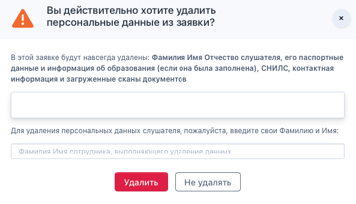

Необходимо подготовить документ - согласие на обработку персональных данных слушателей. Ссылку на него можно сразу разместить как на welcome-screen, так и далее на странице создания/редактирования организации. 

{width=415px height=144px}

Когда организация добавит ссылку на согласие, то в ЛК слушателя появится возможность ознакомиться с документом и прожать чек-бокс согласия на обработку ПД.

### Удаление персональных данных

На странице заявки в блок с "Общими" данными есть кнопка "Удалить персональные данные".

{width=530px height=218px}

Кнопка доступна только в конечных этапах заявки. Если человек ещё не зачислен, то его заявку надо сначала отклонить, затем удалить данные. Если человек уже зачислен, то его надо сначала отчислить.\
При нажатии на кнопку показывается модальное окно:

{width=593px height=340px}