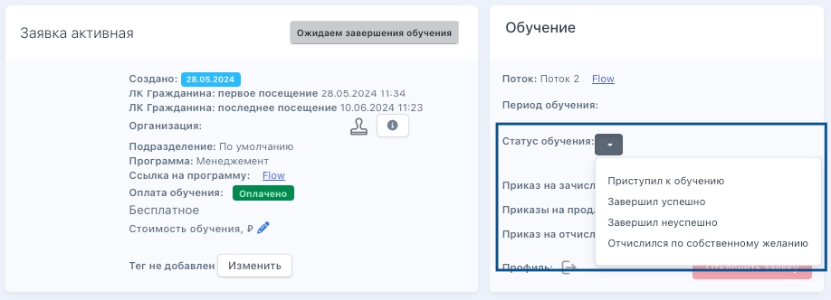
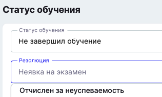

Существует два варианта выставления статуса завершения обучения

[tabs]

[tab:Без интеграции с Odin]

Если Flow CRM не интегрирована с Odin, то статус заявки необходимо выставлять на странице самой заявки в блоке "Обучение" по кнопке.

{width=918px height=332px}

[/tab]

[tab:Интеграция с Odin]

**Как выставить информацию о завершении обучения студенту?**

В случае, если конкретному студенту во время обучения необходимо выставить статус "Отчислился" или по завершении обучения выбрать успешно/неуспешно, можно со страницы профиля сразу перейти на страницу "Завершения обучения". Для этого в профиле в блоке "Статус обучения" есть флажок.

{width=455px height=151px}

**Как выставить информацию о завершении обучения в потоке?**

Когда обучение в потоке по датам закончилось, на странице потока необходимо нажать на «Завершить обучение». Нажатие на кнопку "Завершить обучение" просто откроет страницу для заполнения информации.

{width=778px height=316px}

На данной странице необходимо будет проставить статус по каждому из студентов.

{width=788px height=464px}

Для статуса "Не завершил обучение» доступна резолюция "Отчислен за неуспеваемость».

{width=316px height=189px}

[/tab]

[/tabs]

Условия попадания заявки на шаг "Завершение обучения"

1. Заявка в статусах обучения:

   -  "Завершил успешно"

   -  "Отчислен за неуспеваемость"

   -  "Отчислился по собственному желанию"

2. Выпущен приказ об отчислении.