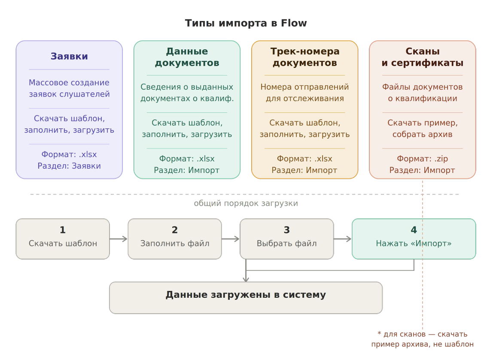

**В системе доступно несколько вариантов импорта. Блок «Импорт» находится в левом боковом меню.**

{width=1148px height=846px}

## **Импорт заявок**

**Массовый способ создания заявок -- загрузка данных слушателей из Excel-файла. Подходит, когда нужно создать несколько заявок за один раз** (*Формат файла: .xlsx*)**.**

:::tip 

**Чтобы попасть на страницу импорта можно использовать схему:** 

-  **Заявки -> Создать заявку -> Импорт заявок**

-  **Импорт в левом боковом меню**

:::

 **Порядок работы**

1. Скачайте шаблон файла по ссылке на странице импорта.

2. Заполните шаблон данными слушателей. Также можно добавить [дополнительные поля](./../../Organization/dopolnitelnye-dokumenty-i-polya-vvoda-dannykh/_index) и [внешние источники](./../../instrukcii/kak-rabotat-s-vneshnimi-istochniki)

3. Выберите образовательную программу для создаваемых заявок.

4. Загрузите файл по кнопке «Выбрать файл».

5. Нажмите «Импорт».

---

:::tip 

**Чтобы попасть на страницу импорта можно использовать раздел импорт в левом боковом меню**

:::

## **Импорт данных документов о квалификации**

**Позволяет массово загрузить сведения о выданных документах об образовании -- дипломах, удостоверениях, сертификатах** (*Формат файла: .xlsx*)**.**

**Порядок работы**

1. На странице импорта скачайте шаблон и ознакомьтесь с инструкцией по его заполнению.

2. Заполните шаблон данными.

3. Загрузите файл по кнопке «Выбрать файл».

4. Нажмите «Импорт».

## **Импорт сканов документов о квалификации и сертификатов**

**Позволяет массово загрузить файлы документов о квалификации и сертификатов в систему.**

**В отличие от других типов импорта, здесь не используется шаблон -- вместо этого нужно собрать архив файлов по примеру, представленному на странице** (*Формат файла: .zip -- не Excel-шаблон, а архив с файлами документов.*)**.**

**Порядок работы**

1. На странице импорта скачайте пример архива и изучите его структуру.

2. Соберите свой архив по аналогии с примером.

3. Загрузите архив по кнопке «Выбрать файл».

4. Нажмите «Импорт».

## **Импорт трек-номеров документов о квалификации**

**Позволяет массово добавить трек-номера почтовых отправлений для отслеживания доставки документов слушателям** (*Формат файла: .xlsx*)**.**

**Порядок работы**

1. На странице импорта скачайте шаблон и ознакомьтесь с инструкцией.

2. Заполните шаблон трек-номерами.

3. Загрузите файл по кнопке «Выбрать файл».

4. Нажмите «Импорт».