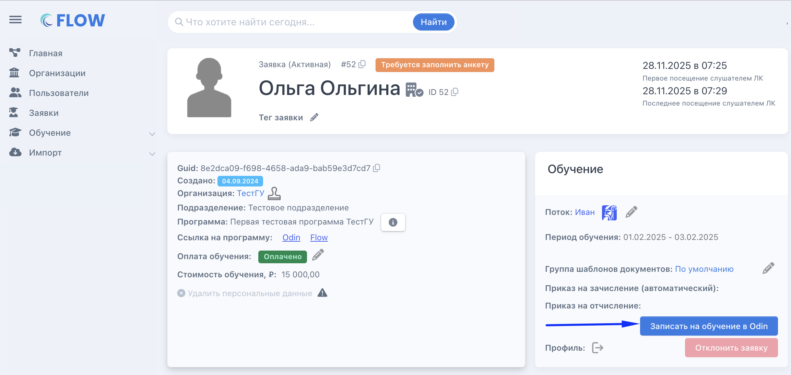
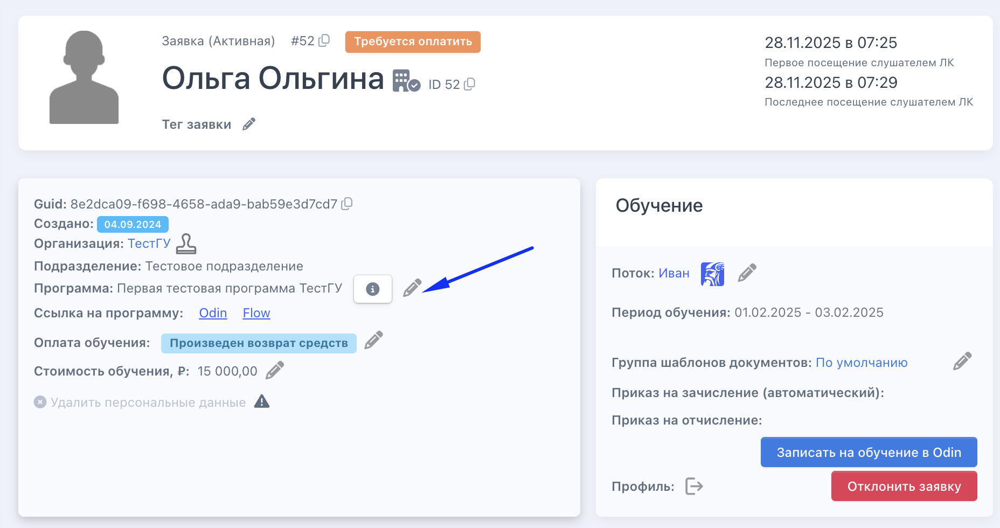
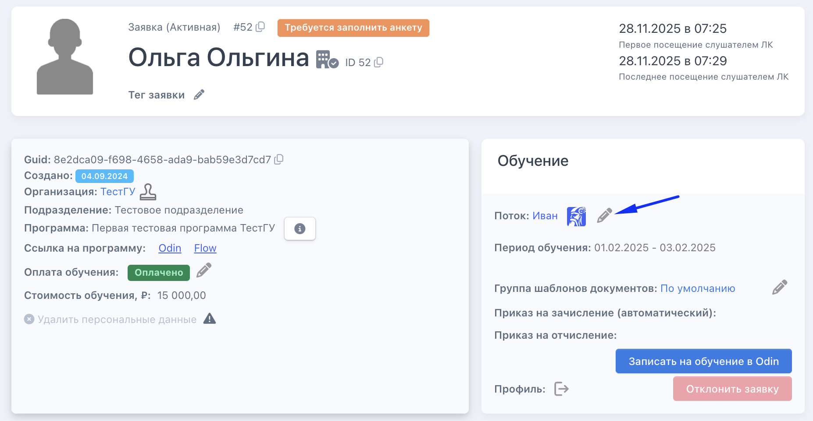

:::info 

Каждая заявка проходит последовательность статусов -  от момента создания до завершения обучения. Статус пересчитывается автоматически при каждом открытии карточки на основе текущих данных: изменили данные - статус обновится сам.

:::

**Ниже представлен интерактивный справочник по всем статусам -- выберите нужный чтобы узнать что происходит на этом этапе и какие действия требуются от менеджера.**

[html]

  

  

  

[/html]

## **Как записать слушателя на обучение вне основного процесса**

**Если программа синхронизирована с Odin, можно записать слушателя на обучение досрочно -- не дожидаясь завершения всех этапов сбора документов. Это позволяет слушателю начать учиться параллельно с оформлением.**

**В карточке заявки по кнопке  «Записать на обучение в Odin». Кнопка доступна при одновременном выполнении всех условий:**

-  есть интеграция с программой Odin;

-  у заявки выбран поток;

-  у заявки нет профиля в Odin.

{width=2306px height=1094px}

После нажатия на кнопку появится предупреждение: слушатель получит письмо-приглашение для входа в Odin и сможет приступить к обучению. Параллельно можно продолжать заполнение анкеты, загрузку документов и оформление приказа на зачисление.

Используйте эту возможность осознанно - после подтверждения слушатель сразу получит доступ к материалам программы.

## **Когда и как можно изменить поток или программу**

**Перевод заявки в другую программу или поток доступен до наступления определённых этапов - после них изменение заблокируется.**

### **Когда можно изменить**

**Перевод доступен до того, как произошло первое из следующих событий:**

-  оплата обучения (после оплаты изменить программу не получится, но можно снять отметку/произвести возврат и затем сменить программу);

-  одобрение заявления и согласия;

-  одобрение договора со слушателем (если договор включён в сценарий).

#### **Как изменить программу**

1. Откройте карточку заявки.

2. Нажмите кнопку «Изменить» рядом с названием программы.

3. Выберите новую программу и поток.

4. Сохраните изменения.

{width=1856px height=980px}

#### **Как изменить поток**

1. Откройте карточку заявки.

2. Нажмите кнопку «Изменить» рядом с названием потока.

3. Выберите новый поток.

4. Сохраните изменения.

   {width=1854px height=962px}

:::tip 

После смены программы или потока статус заявки пересчитается автоматически. Убедитесь что в новой программе настроены необходимые шаблоны документов и потоки открыты для записи.

:::