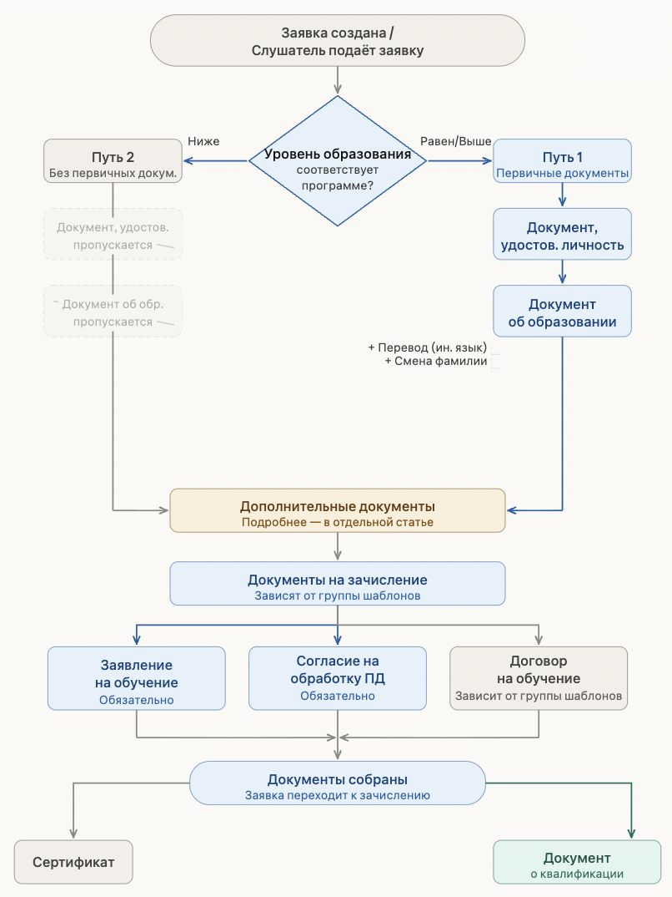

:::info 

При создании образовательной программы указывается **минимально допустимый уровень образования** слушателя. Именно он определяет, какие документы будут собираться в заявке и какой итоговый документ получит слушатель по завершении обучения.

:::

---

### Путь 1 -- уровень образования равен или выше минимального

Если уровень образования слушателя равен или выше минимально заявленного по программе, в заявке собираются **первичные документы (и заполняются соответствующие им поля)**:

-  **Документ, удостоверяющий личность** -- слушатель загружает паспорт или иной документ, удостоверяющий личность.

-  **Документ об образовании** -- слушатель загружает документ о своём текущем образовании. При загрузке доступны две дополнительные настройки:

   -  **Нотариально заверенный перевод** -- если документ об образовании на иностранном языке, слушатель отмечает галочку и загружает перевод.

   -  **Документ о смене фамилии** -- если фамилия в документе об образовании не совпадает с фамилией в документе, удостоверяющем личность (например, после вступления в брак), слушатель отмечает галочку и загружает подтверждающий документ.

По завершении обучения слушатель получает **документ о квалификации**.

### Путь 2 -- уровень образования ниже минимального

Если уровень образования слушателя ниже минимально заявленного по программе, заявка пропускает шаги загрузки первичных документов -- слушатель не загружает ни документ, удостоверяющий личность, ни документ об образовании.

По завершении обучения слушатель получает **сертификат**.

---

### Дополнительные документы

Между загрузкой первичных документов и документов на зачисление слушатель может загрузить дополнительные документы и заполнить дополнительные данные. [Подробнее](./../../Organization/dopolnitelnye-dokumenty-i-polya-vvoda-dannykh/_index)

---

### Документы на зачисление

Следующий этап одинаков для обоих путей. Слушатель загружает документы на зачисление -- их состав зависит от [**группы шаблонов**](./../../Organization/Shablony/_index), привязанной к заявке. Группа шаблонов по умолчанию определяется настройками программы, но её можно изменить в карточке конкретной заявки.

В группу шаблонов всегда входят:

-  **Заявление на обучение** -- обязательно

-  **Согласие на обработку персональных данных** -- обязательно

-  **Договор на обучение** -- зависит от группы шаблонов организации

{width=806px height=1074px}