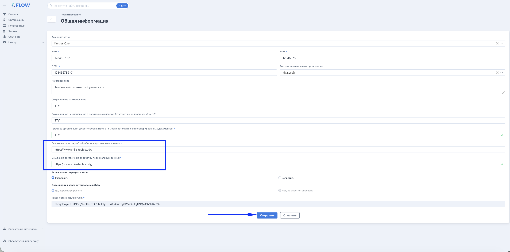
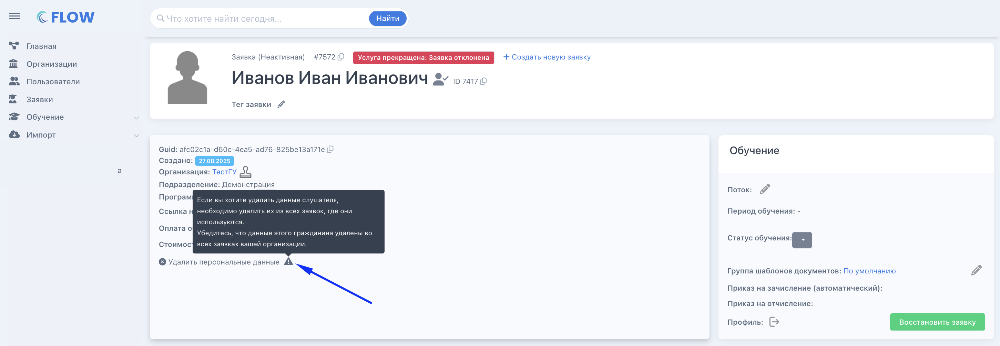

Каждой организации  необходимо подготовить  ссылки на 2 документа:

-   **согласие на обработку персональных данных** (Документ об обработке ПД -- это документ, который описывает правила сбора, использования и защиты персональных данных пользователей. Без этого документа нельзя создавать заявки и получать заявки с лендинга)

-  **политику об обработке персональных данных** (В соответствии с законодательством РФ слушатель должен дать согласие на обработку персональных данных. Укажите ссылку на этот документ, и в личном кабинете слушателя на шаге «Уточнение персональных данных» будет отображён чек-бокс для подтверждения согласия и ссылка для просмотра).

 Ссылку на них можно сразу при регистрации организации/редактирования организации.

{width=2928px height=1452px}

### Удаление персональных данных

На странице заявки в блок с "Общими" данными есть кнопка "Удалить персональные данные». 

:::note 

Удалять ПД следует **из всех заявок в системе**.

:::

Кнопка доступна только в конечных этапах заявки. Если человек ещё не зачислен, то его заявку надо сначала отклонить, затем удалить данные. Если человек уже зачислен, то его надо сначала отчислить. 

{width=2902px height=1006px}

:::note 

При удалении ПД важно помнить, что из сторонних систем данные по заявке необходимо будет удалить самостоятельно.

:::