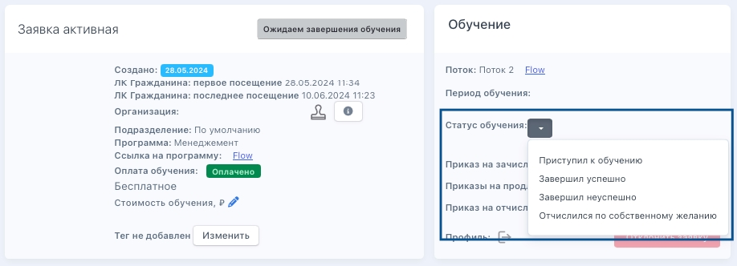
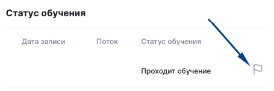
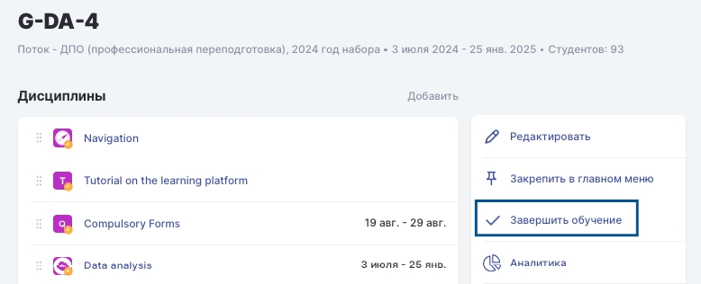
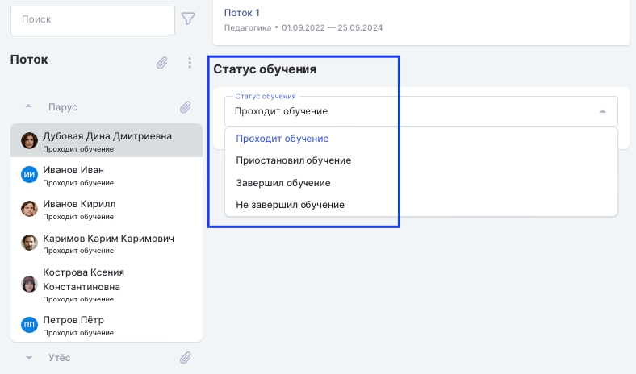
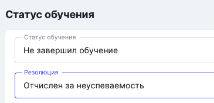

:::info 

После того как обучение завершено, менеджер должен зафиксировать результат в системе и выпустить приказ на отчисление (выпустится автоматически, если в группе шаблонов в заявке установлен автоматический выпуск приказов). 

Способ зависит от того, используется ли интеграция с Odin.

:::

[tabs]

[tab:Без интеграции с Odin]

Если программа  не связана с Odin, то статус заявки необходимо выставлять на странице  заявки в блоке "Обучение" по кнопке.

{width=918px height=332px}

[/tab]

[tab:Интеграция с Odin]

**Как выставить информацию о завершении обучения студенту?**

В случае, если конкретному студенту во время обучения необходимо выставить статус "Отчислился" или по завершении обучения выбрать успешно/неуспешно, можно со страницы профиля сразу перейти на страницу "Завершения обучения". Для этого в профиле в блоке "Статус обучения" есть флажок.

{width=455px height=151px}

**Как выставить информацию о завершении обучения в потоке?**

Когда обучение в потоке по датам закончилось, на странице потока необходимо нажать на «Завершить обучение». Нажатие на кнопку "Завершить обучение" просто откроет страницу для заполнения информации.

{width=778px height=316px}

На данной странице необходимо будет проставить статус по каждому из студентов.

{width=788px height=464px}

Для статуса "Не завершил обучение» доступна резолюция "Отчислен за неуспеваемость».

{width=365px height=176px}

После выставления статуса в  Odin он автоматически подтянется в заявку во  Flow

[/tab]

[/tabs]

После выставления статуса обучения  в заявке/получения статуса обучения из Odin, можно приступить к работе с[ приказами об отчислении](./../../obuchenie/prikaz/dobavlenie-prikazov-vruchnuyu) (автоматические приказы выпустятся автоматически на следующий день).