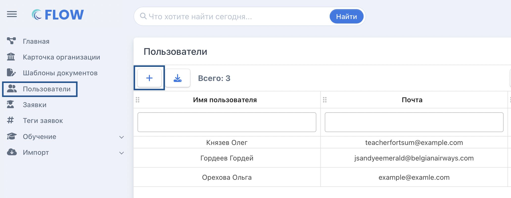
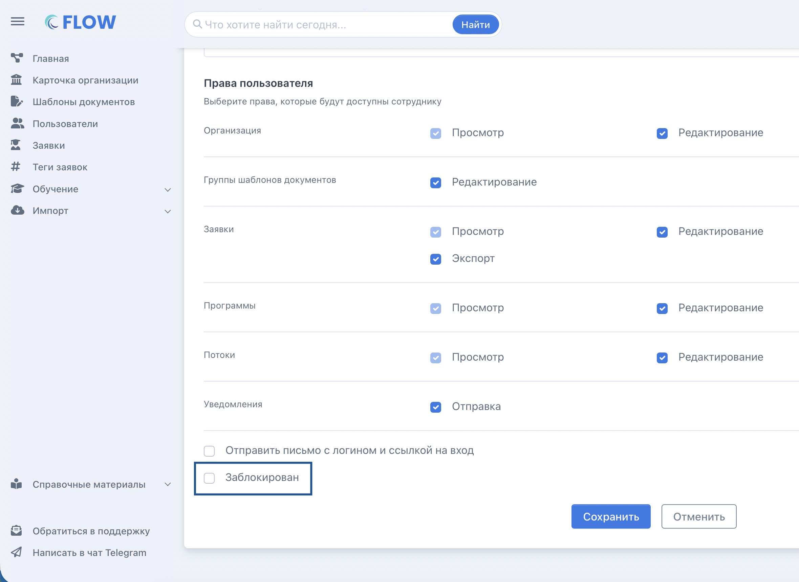
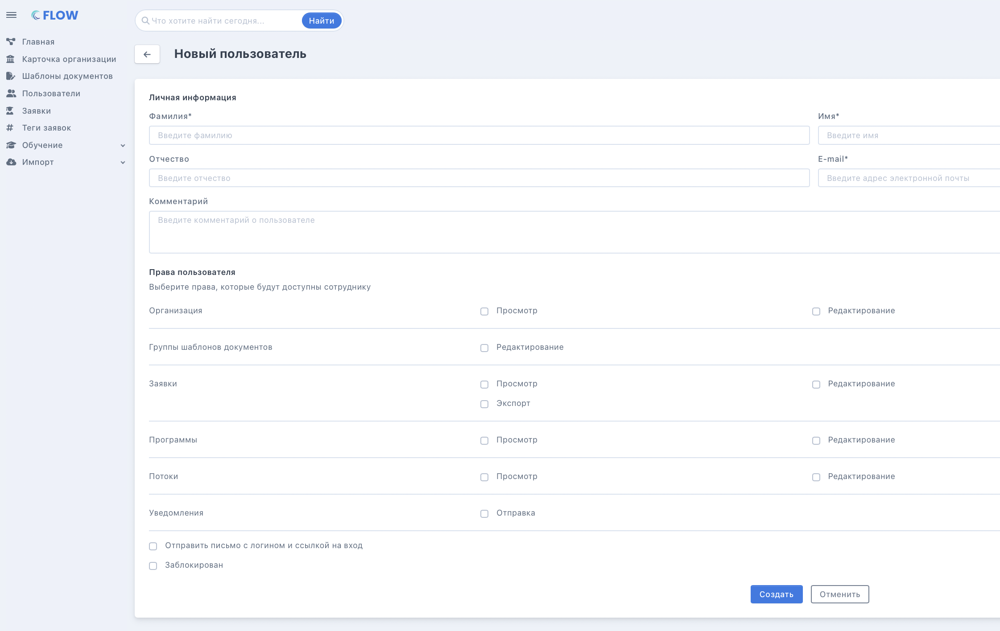
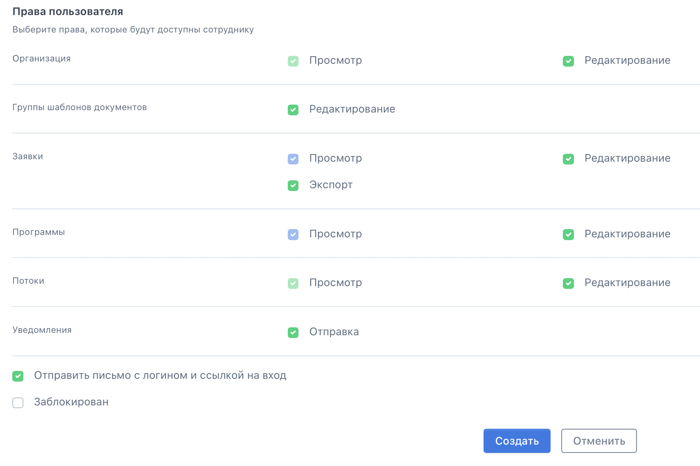

### Представитель организации

Всем пользователям в организации автоматически назначается роль "Представитель организации".

Пользователь с данной ролью может:

-  добавлять [программы](./obuchenie/Programma/_index)

-  создавать [заявки](./slushateli/zayavki/sposoby-sozdaniya-zayavok/_index)

-  проверять [документы слушателей](./slushateli/zayavki/etapy-raboty-s-zayavkoi)

-  просматривать дашборд на главной странице

-  редактировать карточки своих коллег для выдачи прав в системе

.png>)

### Как зарегистрировать сотрудника?

Первый сотрудник организации регистрируется при подаче заявки на сайте <https://www.flow-crm.study/registrations>. Далее уже зарегистрированный сотрудник добавляет своих коллег через меню Пользователи - Кнопка +

{width=2066px height=802px}

Добавленному сотруднику придет письмо с почты **info@flow-crm.study** на установку пароля. Его логин - адрес электронной почты, который был указан при регистрации пользователя. \
Ссылка для входа <https://www.flow-crm.study/Account/Login1FA>

.png>)

## Как заблокировать сотрудника?

Перейдите в список пользователей, выберите сотрудника -> Редактировать -> Заблокирован -> Сохранить.

{width=2360px height=1722px}

## Как выдать права пользователю?

В системе реализован механизм назначения прав через функционал, а именно работа с организациями, работа с заявками и т.д.

Страница добавления нового пользователя поделена на три блока: личная информация (Фамилия, Имя, Отчество, E-mail, Комментарий); права пользователя (чек-боксы Организация, Группа шаблонов документов, Заявки, Программы, Потоки, Уведомления); чек-боксы (Отправить письмо с логином и ссылкой на вход, Заблокирован). 

Общий вид страницы добавления нового пользователя выглядит так:

{width=2242px height=1416px}

В пункте **Организация** право **редактирования** означает, что пользователь:

-  может изменять информацию на странице “Общая информация”;

-  может изменять информацию на страницах “Лицензия”, “Реквизиты”, “Контакты”;

-  может изменять информацию на странице “Подписанты”, добавлять подписантов;

-  может изменять информацию на странице “Подразделения”, добавлять и удалять подразделения;

-  на странице “Пользователи” может создавать, редактировать информацию, удалять, блокировать пользователей (сотрудников организации);

-  может получать уведомления на почту, если кто-то пытается присоединиться к его организации путем самостоятельной регистрации.

В пункте **Группа шаблонов документов** право **редактирования** означает, что пользователь на странице “Шаблоны документов”:

-  может добавлять группу шаблонов документов;

-  может работать с полями “Название” и “Комментарий”;

-  в блоке “Заявления” может смотреть, заменять, скачивать, удалять шаблоны заявлений;

-  в блоке “Выпуск приказов” может менять выпуск с автоматического на ручной, может смотреть, заменять, скачивать, удалять шаблоны приказов;

-  в блоке “Генерация договоров со слушателями” может выбрать, генерировать или нет договоры. При выборе генерации договоров у пользователя есть возможность загрузить свой шаблон договора.

В пункте **Заявки** право **редактирования** означает, что пользователь:

-  может создавать заявки;

-  на странице заявки может редактировать информацию в блоках “Заявка”, “Обучение”, “Личные данные”;

-  может изменить статус оплаты обучения, стоимость в договоре гражданина, отменить или изменить статус обучения;

-  может добавить тег заявки;

-  в блоке “Сканы документов” может создать/заменить, перегенерировать, скачать архив, подтвердить/отклонить документы;

-  может добавить комментарий в блоке “История заявки”;

-  может импортировать заявки, данные о документах квалификации и документы о квалификации.

В пункте **Программы** право **редактирования** означает, что пользователь:

-  может создать программу;

-  может создать поток для программы;

-  может изменить общую информацию о программе;

-  может добавить/удалить стоимость программы;

-  может добавить комментарий в истории программы.

В пункте **Потоки** право **редактирования** означает, что пользователь:

-  может редактировать информацию о потоке,

-  может создавать, редактировать, перевыпускать приказы в разделе “Приказы”.

В пункте **Уведомления** право **отправки** означает, что пользователь может создать массовую рассылку для списка заявок.

Все выданные  пользователю права видны по отмеченным чекбоксам. Если отмечается редактирование, то автоматически проставляется и просмотр. Если чек-бокс активен, то это говорит о возможности изменить права. Если же чек-бокс отмечен более бледным оттенком, то это действие не изменить.

{width=1766px height=1176px}